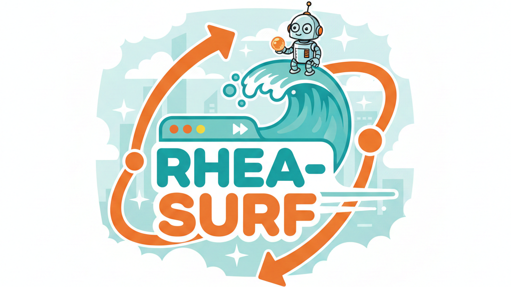

<p align="center">
  
</p>

<h1 align="center">rhea-surf</h1>

<p align="center"><strong>Your browser, your AI, your data.</strong></p>

An open-source browser assistant that runs entirely on your computer. No cloud. No subscriptions. No data leaving your machine.

## Why This Exists

Browser AI assistants like Perplexity Comet are incredibly useful—but they send everything you do to the cloud. Every search, every click, every form you fill out.

rhea-surf is different. It runs on your own computer using open-source AI models. Your browsing stays private. It costs nothing to run. And it gets smarter the more you use it.

## Vision

A world where anyone can have an AI assistant that controls their browser, protects their privacy, and costs nothing to run.

## Goals

### Now
- Read and extract information from websites
- Answer questions about what's on the page
- Learn from successful interactions to get faster over time

### Next
- Chrome sidebar extension—chat with your browser like Perplexity Comet
- Multi-step tasks: "Find me the cheapest flight to Denver next weekend"
- Works on any website, even complex JavaScript apps

### Future
- Voice control
- Automated workflows that run in the background
- Plugin ecosystem for common tasks (shopping, travel, research)

## How It Works

rhea-surf uses [Ollama](https://ollama.ai) to run AI models locally on your machine. No internet required for inference. It controls your browser using the same techniques as other automation tools, but with AI decision-making that runs entirely offline.

```
You ←→ Chrome Extension ←→ Local AI (Ollama)
         ↓
    Your Browser
    (stays local)
```

## Current Status

**Alpha** - Core functionality works. Best for developers and early adopters.

- ✅ Reads and understands web pages
- ✅ Answers questions about page content
- ✅ Learns from past interactions
- ✅ Multiple AI models vote on uncertain decisions
- ✅ Falls back to visual understanding when needed
- 🚧 Chrome extension (coming soon)
- 🚧 Voice interface (planned)

## Quick Start (Technical)

Requires Python 3.10+ and [Ollama](https://ollama.ai).

```bash
# Install Ollama and pull models
ollama pull llama3.1:8b
ollama pull llama3.2-vision

# Install rhea-surf
git clone https://github.com/rhea-impact/rhea-surf
cd rhea-surf
pip install -e .

# Try it
python -m surf.cli "What is the top story on Hacker News?"
```

## For Developers

See [docs/architecture.md](docs/architecture.md) for technical details:

- DOM extraction via Playwright
- Action caching for deterministic replay
- Multi-agent debate for uncertain decisions
- Vision fallback for JS-heavy sites
- Self-improvement tracking with loss functions

## Contributing

This is an open-source project under [rhea-impact](https://github.com/rhea-impact). Contributions welcome.

## License

MIT
